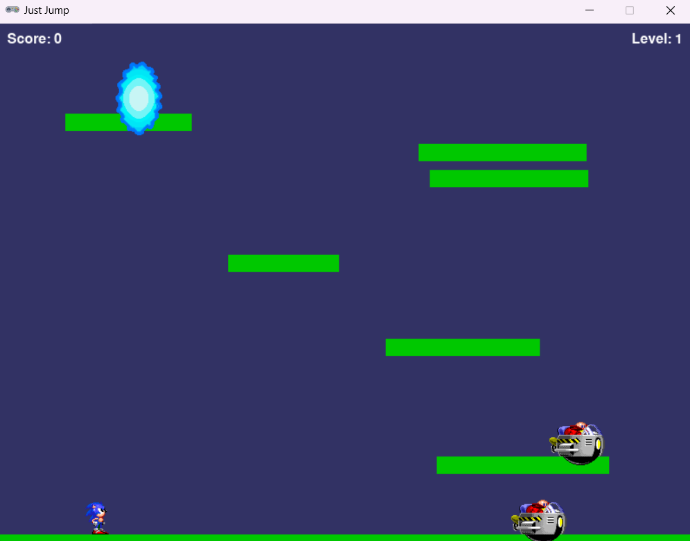

# Just Jump

Um jogo de plataforma 2D onde você deve saltar entre plataformas, evitar inimigos e alcançar o portal para avançar de nível.



## Descrição

Just Jump é um jogo de plataforma desenvolvido com Pygame Zero. Navegue através de níveis gerados proceduralmente, saltando de plataforma em plataforma enquanto evita inimigos. A dificuldade aumenta a cada nível, com mais inimigos e plataformas.

## Características

- Menu principal interativo
- Sprites animados para o jogador e inimigos
- Sistema de níveis progressivamente mais difíceis
- Efeitos sonoros e música de fundo
- Sistema de pontuação

## Instalação

### Pré-requisitos

- Python 3.6 ou superior
- Pygame Zero

### Instalação das dependências
``` pip install pgzero ```

## Como Jogar

Execute o jogo com o seguinte comando:
``` pgzrun main.py ```

### Controles

- **Setas Esquerda/Direita**: Mover o personagem
- **Barra de Espaço** ou **Seta para Cima**: Pular
- **Mouse**: Interagir com os botões do menu

### Objetivo

Alcance o portal azul em cada nível para avançar. Evite tocar nos inimigos, pois isso resultará em Game Over. A cada nível, você ganha pontos e o jogo se torna progressivamente mais desafiador.

## Estrutura do Projeto
```
justjump/
├── main.py            # Código principal do jogo
├── .gitignore         # Arquivos ignorados pelo git
├── images/            # Pasta contendo sprites e imagens
├── sounds/            # Pasta contendo efeitos sonoros
│   ├── jump.wav       # Som de pulo
│   ├── hit.wav        # Som de colisão
│   └── levelup.wav    # Som de avanço de nível
└── music/             # Pasta contendo músicas
├── menu_music.mp3 # Música do menu
└── game_music.mp3 # Música do jogo
```

## Desenvolvimento

Este projeto foi desenvolvido seguindo as diretrizes PEP8 para código Python. Para verificar a conformidade com o PEP8, você pode usar as seguintes ferramentas:

```
pip install flake8 black
flake8 main.py
black main.py
```


## Créditos

Desenvolvido por Daniel Mendes.